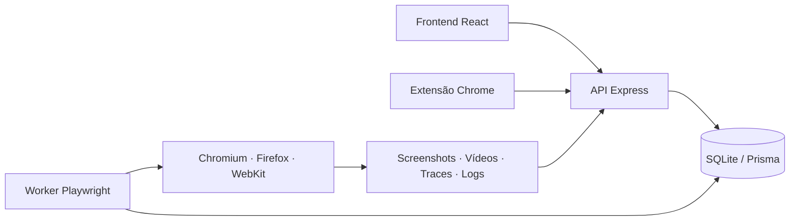

# QA Truker

[](https://github.com/mateuz03/QA-Bug-Tracker/actions/workflows/quality.yml)


Plataforma full stack de gestão e automação de qualidade. O produto conecta requisitos, cenários, gravações, execuções Playwright, evidências e bugs em uma única cadeia rastreável.

```text
Projeto → Requisito → Cenário → Execução → Evidência → Bug → Reteste
```

## Destaques técnicos

- Arquitetura monorepo com frontend React, API Express e worker Node independente.
- Fila persistida com recuperação de execuções interrompidas, cancelamento e proteção contra duplicidade.
- Executor Playwright multi-browser com timeout global e por etapa.
- Catálogo de evidências com screenshots, vídeo, trace, console, rede, retenção e anexos manuais.
- Extensão Chrome própria que grava jornadas e converte eventos em cenários automatizáveis.
- Rastreabilidade ponta a ponta entre projeto, requisito, cenário, execução, evidência e bug.
- Quality Gate com lint, build e testes automatizados no GitHub Actions.

## MVP implementado

- Login, proteção de rotas e perfis administrador/analista.
- Projetos com responsável, repositório e múltiplos ambientes.
- Requisitos com indicador de cobertura.
- Cenários manuais ou automatizados com passos neutros.
- Ações de navegação, preenchimento, clique, seleção e validação.
- Worker Playwright com Chromium, Firefox e WebKit.
- Fila persistida no banco com worker executado em processo separado.
- Progresso automático, cancelamento e reexecução.
- Timeout configurável por cenário e por passo.
- Proteção contra execuções duplicadas e log detalhado.
- Resultado, duração e comparação esperado × encontrado por passo.
- Screenshots configuráveis por falha ou por passo.
- Vídeo WebM, trace Playwright, console e tráfego de rede.
- Central de evidências com anexos manuais e política de retenção.
- Relatório individual exportável em PDF e CSV.
- Criação de bug preenchido a partir de execução reprovada.
- Vínculo entre projeto, cenário, execução e bug.
- Extensão Chrome Manifest V3 para gravação inicial de jornadas.
- Dashboard, filtros, pesquisa, paginação e API REST.
- Testes E2E/API e pipeline GitHub Actions.

## Tecnologias

| Camada | Tecnologia |
|---|---|
| Interface | React 19, TypeScript e Vite |
| API | Node.js, Express e Zod |
| Persistência local | SQLite e Prisma |
| Executor | Playwright e Node.js |
| Gravador | Extensão Chrome Manifest V3 |
| Qualidade | Playwright Test, ESLint e GitHub Actions |

SQLite mantém a demonstração local simples. A evolução planejada para ambiente compartilhado usa PostgreSQL/Supabase, Storage para evidências e um worker isolado em container.

## Arquitetura



O frontend cria e acompanha execuções pela API. O worker reivindica itens da fila pelo banco, executa os passos no navegador e persiste resultados e metadados das evidências. Essa separação evita que testes demorados bloqueiem requisições HTTP.

## Estrutura

```text
qa-truker/
├── frontend/                    # SPA React
├── backend/                     # API, Prisma e worker Playwright
├── apps/
│   └── recorder-extension/      # extensão Chrome do gravador
├── tests/
│   ├── api/
│   ├── e2e/
│   ├── fixtures/
│   └── pages/
├── docs/                        # estratégia e artefatos de QA
└── .github/                     # pipeline e template de bugs
```

## Executar no VS Code

Pré-requisitos: Node.js 22.13 ou superior e npm. O projeto foi validado com Node 24.11.

```powershell
nvm use 24.11.0
Copy-Item backend\.env.example backend\.env -Force
npm install
npm run db:setup
npm run dev
```

- Aplicação: `http://localhost:5173`
- API: `http://localhost:3001`
- Saúde da API: `http://localhost:3001/api/health`

### Usuários de demonstração

| Perfil | E-mail | Senha |
|---|---|---|
| Administrador | admin@qatracker.dev | Qa@123456 |
| Analista | analista@qatracker.dev | Qa@123456 |

## Fluxo do MVP

1. Abra **Projetos** e cadastre o produto e o ambiente.
2. Registre requisitos e crie cenários com passos.
3. Execute um cenário no ambiente escolhido.
4. Acompanhe fila, progresso, logs, comparações e duração de cada passo.
5. Consulte screenshots, vídeo, trace, console e rede na central de evidências.
6. Em uma falha, revise as evidências e clique em **Criar bug**.
7. O bug será vinculado ao cenário e à execução que o originaram.

O cenário `CT-001 — Login com usuário válido` já vem configurado para executar contra a própria aplicação local.

## Gravador Chrome

1. Execute a aplicação.
2. Abra `chrome://extensions`.
3. Ative **Modo do desenvolvedor**.
4. Selecione **Carregar sem compactação**.
5. Escolha `apps/recorder-extension`.
6. Configure API, token, projeto e nome do cenário no popup.

A extensão mascara senhas, captura eventos e os envia para a API. Ao finalizar, os eventos são convertidos em passos de cenário. Consulte [as instruções do gravador](apps/recorder-extension/README.md).

## Testes

```powershell
npx playwright install chromium
npm run lint
npm run build
npm run test:api
npm run test:e2e
```

Relatórios, screenshots, vídeos e traces ficam em `playwright-report/` e `test-results/`.

## Endpoints principais

| Método | Endpoint | Função |
|---|---|---|
| POST | `/api/auth/login` | Autenticar |
| GET/POST | `/api/projects` | Projetos |
| POST | `/api/projects/:id/requirements` | Requisitos |
| GET/POST | `/api/scenarios` | Cenários e passos |
| POST | `/api/executions` | Adicionar cenário à fila |
| GET | `/api/executions/:id` | Resultado e evidências |
| POST | `/api/executions/:id/cancel` | Cancelar execução |
| POST | `/api/executions/:id/retry` | Executar novamente |
| POST | `/api/executions/:id/evidences` | Anexar evidência |
| DELETE | `/api/executions/:id/evidences/:evidenceId` | Remover evidência |
| PATCH | `/api/executions/:id/retention` | Alterar retenção |
| GET | `/api/executions/:id/report.pdf` | Relatório PDF |
| GET | `/api/executions/:id/report.csv` | Exportação CSV |
| POST | `/api/executions/:id/bugs` | Criar bug da falha |
| POST | `/api/recordings` | Iniciar gravação |
| POST | `/api/recordings/:id/events` | Receber evento |
| PATCH | `/api/recordings/:id/finish` | Converter gravação em cenário |
| GET/POST | `/api/bugs` | Gestão de bugs |

## Documentação

- [Arquitetura do MVP](docs/arquitetura-qa-truker.md)
- [Plano de testes](docs/plano-de-testes.md)
- [Matriz de riscos](docs/matriz-de-riscos.md)
- [Cenários BDD](docs/cenarios-bdd.md)
- [Estratégia de automação](docs/estrategia-de-automacao.md)
- [Relatório de execução](docs/relatorio-de-execucao.md)

## Limites conscientes do MVP

- A fila usa SQLite e processa uma execução por worker; escala horizontal exige PostgreSQL e um broker como Redis.
- Evidências ficam no filesystem local com metadados no banco; a evolução indicada é Storage compatível com S3.
- A extensão usa um token inserido pelo usuário; uma versão publicada deve usar autenticação dedicada e restringir o ID da extensão.
- Agendamento, planos/ciclos, histórico de versões e atualização via WebSocket são as próximas etapas.

## Roadmap

- [x] Gestão de projetos, requisitos, cenários e bugs
- [x] Fila assíncrona e worker Playwright
- [x] Evidências avançadas e relatórios PDF/CSV
- [x] Gravador inicial para Chrome
- [ ] Planos, ciclos e suítes de regressão
- [ ] PostgreSQL, object storage e execução distribuída
- [ ] RBAC por projeto e trilha de auditoria
- [ ] Integrações com GitHub, Jira e pipelines externos

## Autor

Projeto pessoal desenvolvido por [Mateus](https://github.com/mateuz03) para demonstrar práticas de QA, automação de testes, desenvolvimento full stack e desenho de uma plataforma de qualidade.
